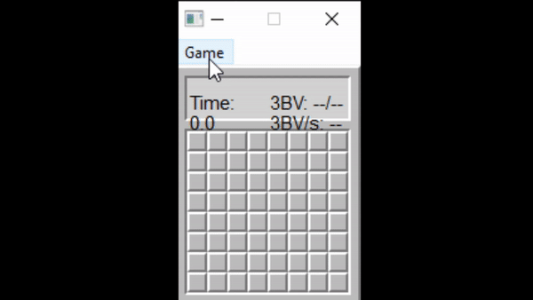
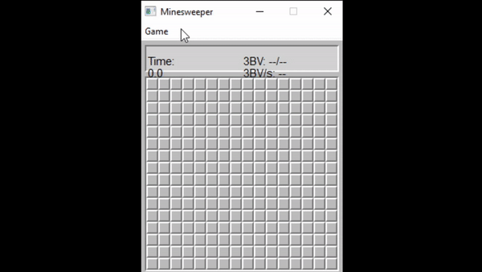
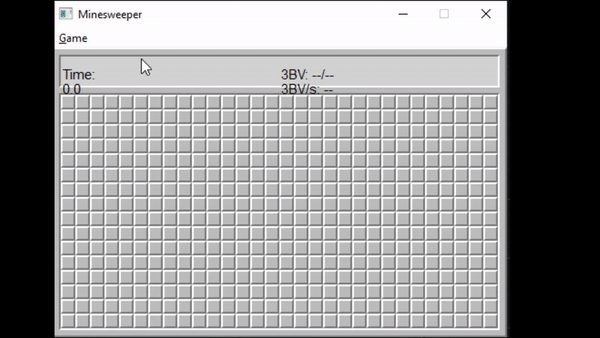

# MineAI

COGS 181 SP20 Final Project

Yang Liu & Yiluo Qin

Minesweeper AI with Convolutional Neural Networks

# Results
Data below are out of 10000 random generated games

| Model                   | Difficulty | Win%   | Mean 3BV Solved% |
|-------------------------|------------|--------|------------------|
| conv_6 layer batch 5000 | Beg        | 84.98% | 96.10%           |
|                         | Int        | 78.66% | 96.97%           |
|                         | Exp        | 22.38% | 79.54%           |
| conv_6 layer batch 7000 | Exp        | 23.44% | 79.30%           |
| conv_7 layer batch 5000 | Beg        | 85.37% | 96.16%           |
|                         | Int        | 79.92% | 97.12%           |
|                         | Exp        | 25.57% | 81.29%           |

# Sample Solves

